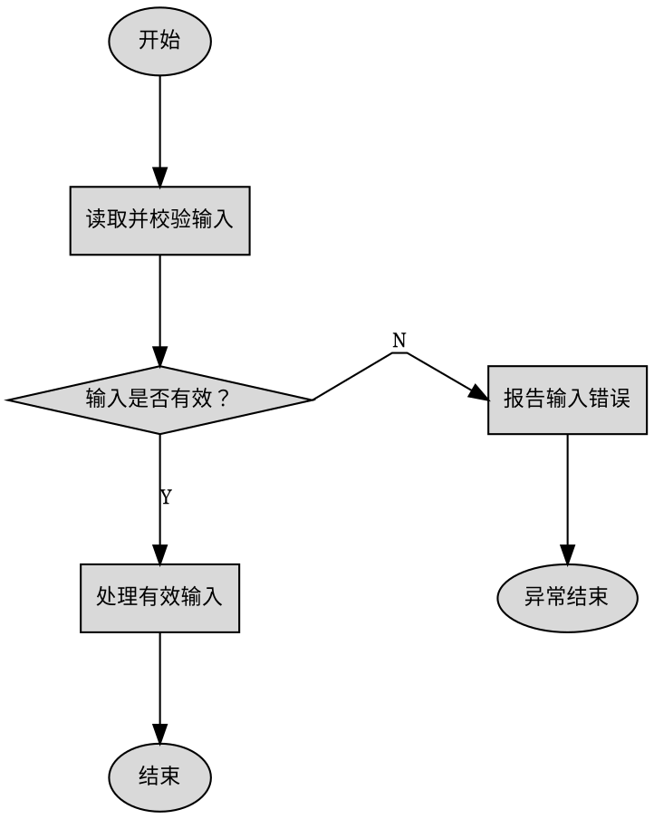

# Flow To Visio

生成原生、可编辑的 `.vsdx` 流程图，不使用 Mermaid，也不生成仅含图片的流程图。AI 分析流程并编写 Graphviz DOT，内置转换器生成 Visio 形状、文字和连线。

## 输出目录

在用户指定的项目根目录创建：

```text
flowcharts/
  project-overview.md
  project-flowcharts.vsdx
  .temp/
    project-flow.dot
    project-flow.plain
    <module>-flow.dot
    <module>-flow.plain
```

DOT 和 Plain 全部放入 `.temp/`；根目录只保留分析文档和最终 Visio。

## 转换器

从当前技能位置解析技能目录，在其 `scripts/` 中查找文件名包含 `Graphviz2Visio`（不区分大小写）的 `.exe`：

- 恰好一个匹配项：始终使用其绝对路径。
- 没有或多于一个：停止并报告候选项，不得猜测。
- Graphviz 定位失败：用同一转换器执行 `where-dot`。
- 仅当用户要求转换时打开 Visio，才添加 `--visible`。

```powershell
$converter = Get-ChildItem -Path "<skill-directory>\scripts" -File -Filter "*.exe" |
  Where-Object { $_.Name -match "Graphviz2Visio" }

& $converter.FullName validate-dot flowcharts\.temp\diagram.dot
& $converter.FullName dot2plain flowcharts\.temp\diagram.dot flowcharts\.temp\diagram.plain
& $converter.FullName validate-layout flowcharts\.temp\diagram.plain

& $converter.FullName plain2visio-batch flowcharts\project-flowcharts.vsdx `
  flowcharts\.temp\project-flow.plain flowcharts\.temp\<module>-flow.plain `
  --page-name "项目主流程" --page-name "模块业务流程"
```

每个 Plain 输入必须按相同顺序对应一个 `--page-name`，每个输入生成一个独立页面。所有页面通过一次 `plain2visio-batch` 生成到同一个 `.vsdx`。

## 两步验证闭环

每个页面必须先通过规则验证和几何验证，才能参与最终 Visio 转换。初次生成不计为重试；任一步失败后最多修改并重新验证 3 次，即每个页面最多执行 4 轮验证。不得无限重试，也不得在验证失败时生成或覆盖最终 `.vsdx`。

每轮按以下顺序执行：

1. 对 DOT 执行 `validate-dot`。退出码为 `0` 才能继续；退出码为 `3` 时读取 JSON 中的 `code`、`node`、`edge`、`otherEdge` 和坐标，针对具体问题修改 DOT。
2. DOT 通过后执行 `dot2plain`，不得复用上一次失败轮次留下的 Plain。
3. 对新生成的 Plain 执行 `validate-layout`。退出码为 `0` 表示该页面通过；退出码为 `3` 时根据 JSON 报告修改 DOT，并从第一步重新开始。
4. 所有页面均通过两步验证后，才按既定顺序执行一次 `plain2visio-batch`。

重试时按最小改动原则依次尝试：调换侧分支方向；调整 `rank=same`；增大 `nodesep` 或 `ranksep`；缩短并局部结束分支；最后拆分页面。不得为了通过验证而删除关键业务阶段、判断、循环、失败结果或外部交互。

连续 3 次重试后仍失败时立即停止。保留 DOT、最新 Plain 和最后一次 JSON 报告，向用户说明失败页面、剩余问题及涉及的节点或边；不得声称 Visio 已成功生成。

## 分层代码分析

流程图的完整性来自入口、出口、关键节点和调用关系的覆盖，不来自逐行阅读。采用“结构优先、广度展开、按需下钻”。

### 第一层：范围与代码地图

1. 明确分析对象是函数、文件、模块还是仓库。仓库级分析先定位可执行入口；多个入口同等合理时请用户选择。
2. 先看目录、构建配置、入口、模块边界和主要接口，不立即展开函数体。
3. 分析项目自有且与当前流程相关的源码；排除第三方依赖、生成文件、构建产物和供应商代码。
4. 建立模块清单，记录职责、入口、出口、依赖和模块关系。

### 第二层：从入口广度展开

沿执行方向追踪，每个函数或模块只提取：职责、关键调用、条件、循环、重要数据或状态变化、外部交互、阶段切换、输出和用户可见失败。

调用关系和下一节点已经明确时立即停止下钻。普通辅助函数概括为一个业务步骤；忽略或合并普通赋值、日志、迭代器细节、清理样板及不影响流程的低层重复操作。

### 第三层：检查隐藏调用

检查 function pointer、callback、操作表、注册表、初始化数组、宏注册、weak function、条件编译、构建配置、中断/线程/任务/状态机入口，以及生成代码或链接机制形成的调用。只读取确认关系所需的定义。

### 第四层：只下钻不确定节点

仅在下列情况深入实现：无法确定下一节点；函数控制关键分支、循环、状态转换或恢复；间接调用目标不明；配置或运行状态选择多个实现；内部包含应单独绘制的重要子流程。

关系确认后立即停止，不为“读完整个项目”打开无关代码。

### 第五层：完整性复核

1. 从入口正向检查成功路径、分支、循环、失败路径和出口。
2. 从出口反向检查控制条件和来源节点是否有代码依据。
3. 再次检查隐藏调用和配置变体。
4. 无法可靠确定的路径标为不确定，不得自行补全。

## 分析文档与页面

`project-overview.md` 记录：分析范围与忽略项；入口、出口和阶段；模块及源文件/头文件映射；依赖与关键调用；主路径、分支、循环和失败结果；不确定节点；图中节点到源码的追踪表。

| 图中节点 | 源文件 | 行号范围 | 对应符号 | 关系类型 |
| --- | --- | --- | --- | --- |
| 读取并校验输入 | `src/input.c` | 20–48 | `load_input` | 直接调用 |

追踪信息只写入 Markdown，不画进流程图。

生成一个项目总流程页、每个模块的流程页，以及必要的函数/子流程页。项目页只展示入口、模块关系和阶段切换；模块页说明内部工作方式，不能退化成单个调用框。项目页排第一，其后为模块页和子流程页。

默认中等详细度。保留决定路径的校验、条件、循环、状态变化、数据转换、外部交互、输出和独立失败结果；隐藏实现细节。典型模块页以 8～20 个业务节点为参考而非硬性指标；非简单模块少于 6 个节点时检查是否过度合并。页面过于复杂时拆分，不得删除关键阶段或控制判断。

## 图中文字

- 所有可见节点、判断和页面标题使用简洁中文；页面标题必须唯一。
- 不显示原始函数名、类名、异常类型、参数、变量、赋值、`return`、API 调用或代码表达式。
- 描述业务效果：`Parse(path)` 写成“解析布局文件”，`File.Exists(path)` 写成“输入文件是否存在？”。
- 节点最多两行，通常每行不超过 18 个汉字。
- 页面标题不得使用文件名、原始符号或英文标识符。
- 连线文字仅允许 `Y` 和 `N`。

## 内容与布局硬约束

1. 会改变路径、重要数据/状态，调用外部系统，产生输出或独立失败结果的阶段必须单独显示。
2. 有失败分支的读取、校验和解析不得合并。相邻操作只有目的相同且中间无判断、状态边界、外部交互或失败边界时才可合并，通常不超过三个操作。
3. 重要循环显示条件、主体效果和退出结果；循环返回边使用 `constraint=false`，并从节点同一侧进出，尽量形成独立外侧通道。返回线过长、穿过主列或主导页面时拆分子流程。
4. 每页确定一条主要成功路径，按执行顺序置于居中的垂直列。主路径相邻节点直接由上向下连接。
5. 每个判断恰有一条 `Y` 和一条 `N` 输出；输入从顶部进入，主路径从底部离开，侧分支从最合适的左侧或右侧离开。必要时改写问题，使主要结果向下。
6. 侧分支必须短、近且只属于其控制判断；最多向一个水平方向延伸一次，不得穿过主列、跨越其他区域或反向折返。侧分支需要汇合时，只能在附近的后续节点局部汇合；无法局部汇合时分别结束或拆分子流程。
7. 普通处理框只能有一个业务出口，不得充当三路以上分发器。三个以上选择使用简短纵向判断链；仍复杂时拆分页面。
8. 不把全局 `try/catch/finally` 等实现结构画成节点，只保留影响流程的业务错误分支。
9. 多条路径只有能在结束节点附近局部汇合且不交叉时才共用结束节点，否则分别结束。
10. 拒绝跨页水平长线、反复左右折返、连线穿过节点/分支或绕页面边界的布局；先拆页，再省略实现级细节并重新生成。

## DOT 规则

使用从上到下的 DOT、稳定 ID 和中文标签，以 `\n` 换行，不得生成 Mermaid。默认使用 `splines=polyline`：当前流程同时依赖端口和 `Y`/`N` 边标签，不得改为会忽略这些信息的 `splines=ortho`。避免交叉、保持分支方向和标签正确，优先级高于绝对正交；需要更整齐时通过拆页、缩短侧支和增加间距解决。

### 判断与短侧分支模板



### 外侧循环模板

循环判断的退出结果沿主路径向下，返回结果从同一侧回到较早节点。循环边仅负责返回，不参与主路径排序；如果仍穿过节点或其他分支，必须拆成独立子流程页。

```dot
validate -> process [tailport=s, headport=n];
process -> retry [tailport=s, headport=n];
retry -> finish [label="N", tailport=s, headport=n];
retry -> validate [label="Y", constraint=false, tailport=w, headport=w];
```

### 多路选择模板

三个以上结果不得从一个处理框或判断框横向扇出，改写成纵向判断链；每个菱形仍只有 `Y` 和 `N` 两个输出。

```dot
choose_a -> handle_a [label="Y", tailport=e, headport=w];
choose_a -> choose_b [label="N", tailport=s, headport=n];
choose_b -> handle_b [label="Y", tailport=e, headport=w];
choose_b -> handle_default [label="N", tailport=s, headport=n];
```

形状：`oval` 表示开始/结束，`box` 表示业务步骤，`diamond` 表示条件；`parallelogram` 和 `note` 仅在确有必要时使用。

所有判断输入使用 `headport=n`；主输出使用 `tailport=s`，侧输出使用 `tailport=e` 或 `tailport=w`；禁止从菱形顶部输出。`Y`/`N` 必须贴在实际连线上并验证对应关系。

所有主路径边显式使用 `tailport=s, headport=n`，不得使用 `constraint=false`。`rank=same` 只允许同时放置“一个控制判断节点和它的一个直接侧分支节点”；不得把两个连续主路径节点放入同一 rank，也不得用它横向排列多个业务阶段。`constraint=false` 只用于真正的循环返回边。

## 完成检查

转换器默认样式为浅灰填充、黑边、宋体、居中文字、圆角终止符、折线连线和纵向页面；保持 DOT 简洁。

完成前确认 `.vsdx` 存在、页面数及中文标题正确、关键路径可追踪、无明显交叉/长线、`Y`/`N` 无误。最后报告输出路径、页面名称、分析及忽略范围，以及无法可靠推断的代码路径。
