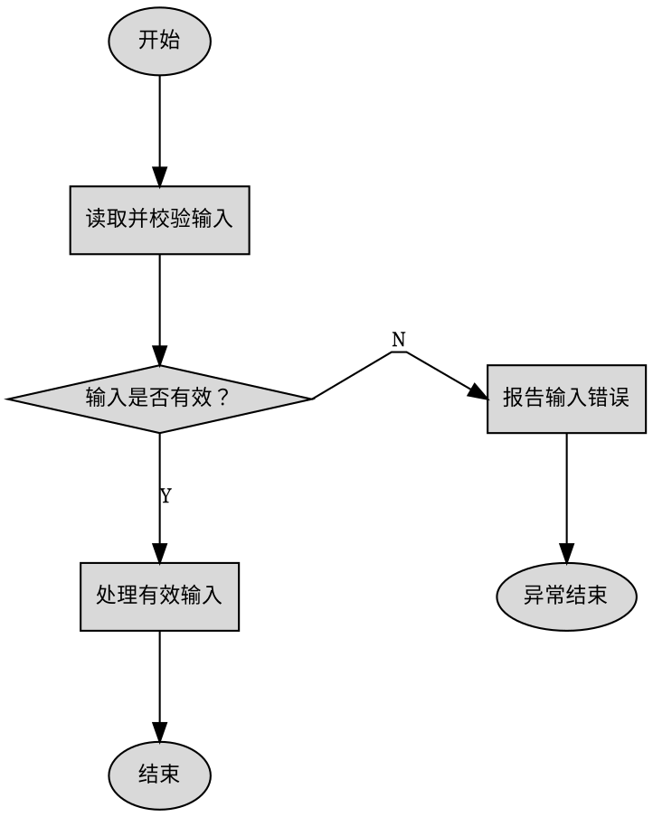

# Flow To Visio

当前技能版本：0.5.4。首次进度消息必须报告“已加载 flow2visio v0.5.4”。

生成原生、可编辑的 `.vsdx`，不使用 Mermaid，也不生成仅含图片的图。AI 分析架构和流程并准备 DOT 或 Plain，内置转换器生成 Visio 形状、文字和连线。

## 输出目录

在用户指定的项目根目录创建：

```text
flowcharts/
  project-overview.md
  project-flowcharts.vsdx
  .temp/
    project-flow.dot
    project-flow.plain
    software-architecture.plain
    memory-layout.plain
    <module>-flow.dot
    <module>-flow.plain
```

DOT 和 Plain 全部放入 `.temp/`；根目录只保留分析文档和最终 Visio。

## 转换器

从当前技能位置解析技能目录，在其 `scripts/` 中查找文件名包含 `Graphviz2Visio`（不区分大小写）的 `.exe`：

- 恰好一个匹配项：始终使用其绝对路径。
- 没有或多于一个：停止并报告候选项，不得猜测。
- Graphviz 定位失败：用同一转换器执行 `where-dot`。
- 仅当用户要求转换时打开 Visio，才添加 `--visible`。

```powershell
$converter = Get-ChildItem -Path "<skill-directory>\scripts" -File -Filter "*.exe" |
  Where-Object { $_.Name -match "Graphviz2Visio" }

& $converter.FullName validate-dot flowcharts\.temp\diagram.dot
& $converter.FullName dot2plain flowcharts\.temp\diagram.dot flowcharts\.temp\diagram.plain
& $converter.FullName validate-layout flowcharts\.temp\diagram.plain

& $converter.FullName plain2visio-batch flowcharts\project-flowcharts.vsdx `
  flowcharts\.temp\software-architecture.plain `
  flowcharts\.temp\project-flow.plain flowcharts\.temp\<module>-flow.plain `
  --page-name "软件架构总览" --page-name "项目主流程" --page-name "模块业务流程"
```

每个 Plain 输入必须按相同顺序对应一个 `--page-name`，每个输入生成一个独立页面。所有页面通过一次 `plain2visio-batch` 生成到同一个 `.vsdx`。

## 检测、修复与验证闭环

流程页面使用同一转换器完成确定性闭环，不让 Agent 反复试探几何布局：

1. 对 DOT 执行 `validate-dot`。只有 DOT 结构规则通过后才继续。
2. 执行 `dot2plain`。Graphviz 负责节点分层和位置；其边路径只作为端口方向提示。
3. 对新 Plain 执行 `validate-layout`。该命令先在 `detected` 中报告 Graphviz 原始路径问题，再运行曼哈顿正交路由器自动修复，最后在 `validation` 中验证实际待渲染路线。
4. 以 `validation.passed` 和进程退出码为准。`detected` 中存在问题但 `validation.passed=true` 时无需修改 DOT。
5. 所有页面通过后执行一次 `plain2visio-batch`。Renderer 会再次运行同一套路由和验证；验证失败时拒绝覆盖正式 `.vsdx`。每条逻辑边必须输出为一个完整 Visio 折线形状。

路由器对每条边最多计算两个候选：先寻找不穿节点且不与已路由边冲突的路径；无解时再寻找带高冲突惩罚的兜底路径。两次均为确定性计算，不触发 Agent 重写 DOT。

只有 `validation.passed=false` 时，Agent 才能根据最终 JSON 报告做一次结构性修正，例如调换侧支方向、调整 `rank=same`、增加间距或拆页，然后完整重跑上述步骤。每页最多一次 Agent 修正、两轮验证；仍失败时立即停止该页，保留 DOT、最新 Plain 和 JSON 报告并说明剩余问题，不得继续自我校验或声称正式 Visio 已生成。

## 分层代码分析

流程图的完整性来自入口、出口、关键节点和调用关系的覆盖，不来自逐行阅读。采用“结构优先、广度展开、按需下钻”。

### 第一层：范围与代码地图

1. 明确分析对象是函数、文件、模块还是仓库。仓库级分析先定位可执行入口；多个入口同等合理时请用户选择。
2. 先看目录、构建配置、入口、模块边界和主要接口，不立即展开函数体。
3. 分析项目自有且与当前流程相关的源码；排除第三方依赖、生成文件、构建产物和供应商代码。
4. 建立模块清单，记录职责、入口、出口、依赖和模块关系。

### 第二层：从入口广度展开

沿执行方向追踪，每个函数或模块只提取：职责、关键调用、条件、循环、重要数据或状态变化、外部交互、阶段切换、输出和用户可见失败。

调用关系和下一节点已经明确时立即停止下钻。普通辅助函数概括为一个业务步骤；忽略或合并普通赋值、日志、迭代器细节、清理样板及不影响流程的低层重复操作。

### 第三层：检查隐藏调用

检查 function pointer、callback、操作表、注册表、初始化数组、宏注册、weak function、条件编译、构建配置、中断/线程/任务/状态机入口，以及生成代码或链接机制形成的调用。只读取确认关系所需的定义。

### 第四层：只下钻不确定节点

仅在下列情况深入实现：无法确定下一节点；函数控制关键分支、循环、状态转换或恢复；间接调用目标不明；配置或运行状态选择多个实现；内部包含应单独绘制的重要子流程。

关系确认后立即停止，不为“读完整个项目”打开无关代码。

### 第五层：完整性复核

1. 从入口正向检查成功路径、分支、循环、失败路径和出口。
2. 从出口反向检查控制条件和来源节点是否有代码依据。
3. 再次检查隐藏调用和配置变体。
4. 无法可靠确定的路径标为不确定，不得自行补全。

## 执行模型与页面计划

读取目录、构建配置、入口和任务创建代码后，先判断项目是无 RTOS、RTOS 或无法确定，并在深入分析前列出计划页面。页面按执行入口和执行上下文决定，不按源码目录或模块数量机械生成。

无 RTOS 项目以 `main` 或等价入口的长期 `while`、`for` 或 `do` 主循环作为模块识别的第一依据。先按源码顺序完整枚举循环内的直接调用、宏调用、周期判断、状态机分发、任务表及回调入口，再分析循环外的初始化、中断和异步回调；不得先凭目录或函数大小筛选模块。

主循环中每个独立调度项都视为正式模块，必须进入模块清单并追踪到实际处理入口。`RunTaskA(callback, slot)`、类似时间片封装以及函数指针表的每个注册项均为独立执行入口；不得因调用形式重复、没有注释、函数较短或多个入口使用同一封装而省略。注释与符号或实现冲突时，以实际代码为准并记录冲突。

主循环/调度总览必须为每个调度项显示独立节点；每个不同的实际处理入口还必须生成一张独立模块流程页。多个调度项只有调用同一个实际入口时才能共用该入口的模块页，但总览和覆盖表仍分别保留每个时间片。不得把不同入口合并到同一模块页。

独立成页不设重要性门槛。被动执行、只读取其他模块设置的状态、没有主动触发、没有失败分支、主要是时序控制、仅操作 GPIO/PWM/Flash 或函数较短，都不能成为取消页面的理由；硬件输出和持久化写入属于模块外部交互，播放时序、去重、中断旧动作和输出序列属于可绘制的控制流程。实现很简单时允许页面只有少量节点，但不得并入总览后消失。入口实现无法取得时仍保留该页并标记“实现未找到”，不得猜测流程。

在 `project-overview.md` 建立“主循环覆盖表”，至少记录调度项、时间片或触发条件、实际入口、模块职责、所在页面和源码依据。完成前将覆盖表逐项反查主循环，数量和顺序必须一致；间接目标无法确定时标为不确定，不得删除。

RTOS 项目从系统入口追踪初始化、任务创建和调度器启动，生成系统启动页、任务关系页，以及每个明确创建或注册任务的独立流程页。任务不因优先级低、流程简单、被动等待或功能相近而合并或省略。任务页展示实际存在的等待条件、循环、消息处理、状态变化和输出；简单中断、回调和定时器归入其唤醒或服务的任务，只有其自身包含独立状态机或恢复流程时才额外成页。

主要执行上下文是：无 RTOS 的主入口、主循环和每个调度模块；RTOS 的启动过程和每个已创建或注册任务。普通辅助函数不增加页面，但调度器参数中的处理入口绝不能归类为普通辅助函数。无法判断是否使用 RTOS 时，在文档中说明依据和不确定点，不得猜测任务关系。

## 软件架构图

仓库或模块级分析默认只生成一页简洁的“软件架构总览”。采用横向分层结构：每层是一个横向大区域，左侧是层名称，右侧并排放置该层组件，整体效果类似常见的展示层、服务层、驱动层、数据层架构图。架构图表示静态组成和职责，不画函数内部顺序、条件或循环。

- 根据实际项目归纳 3～4 层，不得超过 4 层，也不得为了套模板补齐不存在的层。
- 每层保留 2～5 个职责组件；全页通常不超过 16 个组件。过多模块按相近职责合并，详细清单和依赖写入 Markdown，不再拆出复杂架构页。
- 一个框表示模块组、任务组、服务、中间件、驱动组或硬件组；框内只写简洁中文名称，最多两行。
- 无 RTOS 项目通常归纳为应用业务层、调度与公共服务层、驱动与 HAL 层、硬件与存储层；RTOS 项目通常归纳为应用层、任务与服务层、RTOS 与中间件层、驱动与硬件层。层名必须按实际代码调整。
- 普通工具函数、简单封装和第三方内部实现不进入架构图；只保留能说明系统结构的主要职责。
- 默认不画组件依赖箭头、虚线、嵌套子系统或通信细节，避免交叉和视觉噪声；这些关系记录在 `project-overview.md`。
- 无法确定归属的组件放入最接近的已有层并在 Markdown 标记，不得新增第五层。

架构图不使用 Graphviz DOT，直接生成 `.temp/software-architecture.plain`。先写每层的横向背景框和左侧层名框，再写位于背景框内部的组件框，保证组件显示在背景之上；页面中不生成任何 `edge`。全部节点外边界限制在 6.0×8.5 英寸内，各层等宽、等高、上下对齐，层间距不超过 0.12 英寸；不得扩大页面或缩小字体。对生成的 Plain 执行 `validate-layout` 后再加入批量转换。

## 通用存储器布局图

检查链接脚本、分区表、DTS、烧录配置、升级脚本和可靠的地址常量，识别内部或外部 Flash、EEPROM、NVRAM、SPI NOR/NAND 等非易失性存储器。适用于 STM32、其他 Cortex-M、8 位机、ESP32 和嵌入式 Linux，不按芯片品牌套用固定分区。

只有存在两个或以上有可靠地址边界的逻辑区域时才生成“存储器布局”页。没有分区、仅使用整个存储器、证据不足或地址互相矛盾时不生成，并在 Markdown 说明原因；不得根据常见芯片布局猜测。

每个存储设备显示名称、总容量，以及每个区域的中文名称、起止地址、真实容量和只读、升级、校准等重要属性。绘制前计算并检查重叠、越界、空洞、对齐和总容量；明确显示未分配空间。视觉高度尽量按真实容量比例，过小区域允许使用最小显示高度，但必须标注真实容量。

存储布局没有业务连线，不使用 DOT 自动排版。直接生成 `.temp/memory-layout.plain`：每个区域是同宽、紧邻、纵向堆叠的 `box` 节点，按高地址在上、低地址在下排列。对该 Plain 执行 `validate-layout` 后再加入批量转换。

存储布局必须限制在纵向页面内，禁止通过增大页面容纳过大的图：全部节点外边界的总宽度不得超过 6.0 英寸，总高度不得超过 9.0 英寸；单个存储设备默认宽 5.5～6.0 英寸，多个设备最多并排两列且总宽仍不得超过 6.0 英寸。每个分区最小显示高度为 0.35 英寸，相邻分区间距不超过 0.03 英寸。

在扣除间距后，分区显示高度按 `0.35 + 剩余可用高度 × 分区容量/设备总容量` 分配，再整体缩放到不超过 9.0 英寸；标签最多两行，保留名称、地址范围和容量，其他属性写入 Markdown。单页超过 16 个分区、最小高度之和超限、两列后仍超宽或文字无法阅读时，按连续地址范围拆成多个唯一标题页面，不得缩小字体或扩大页面。

## 分析文档与页面

`project-overview.md` 记录：分析范围与忽略项；入口、出口和阶段；模块及源文件/头文件映射；依赖与关键调用；主路径、分支、循环和失败结果；不确定节点；图中节点到源码的追踪表。

| 图中节点 | 源文件 | 行号范围 | 对应符号 | 关系类型 |
| --- | --- | --- | --- | --- |
| 读取并校验输入 | `src/input.c` | 20–48 | `load_input` | 直接调用 |

追踪信息只写入 Markdown，不画进流程图。

页面默认依次为：软件架构总览、项目主流程、主循环或任务关系、每个调度模块或 RTOS 任务的独立流程、必要子流程、可选存储器布局。项目页只展示入口、主要执行上下文和阶段切换；任务或模块页必须依据实际实现说明内部工作方式。

默认中等详细度。保留决定路径的校验、条件、循环、状态变化、数据转换、外部交互、输出和独立失败结果；隐藏实现细节。复杂模块页通常为 8～20 个业务节点，简单模块允许少于 6 个节点，不能因节点少而取消页面。页面过于复杂时拆分，不得删除关键阶段或控制判断。

## 图中文字

- 所有可见节点、判断和页面标题使用简洁中文；页面标题必须唯一。
- 不显示原始函数名、类名、异常类型、参数、变量、赋值、`return`、API 调用或代码表达式。
- 描述业务效果：`Parse(path)` 写成“解析布局文件”，`File.Exists(path)` 写成“输入文件是否存在？”。
- 节点最多两行，通常每行不超过 18 个汉字。
- 页面标题不得使用文件名、原始符号或英文标识符。
- 连线文字仅允许 `Y` 和 `N`。

## 内容与布局硬约束

1. 会改变路径、重要数据/状态，调用外部系统，产生输出或独立失败结果的阶段必须单独显示。
2. 有失败分支的读取、校验和解析不得合并。相邻操作只有目的相同且中间无判断、状态边界、外部交互或失败边界时才可合并，通常不超过三个操作。
3. 重要循环显示条件、主体效果和退出结果；循环返回边使用 `constraint=false`，并从节点同一侧进出，尽量形成独立外侧通道。返回线过长、穿过主列或主导页面时拆分子流程。
4. 每页确定一条主要成功路径，按执行顺序置于居中的垂直列。主路径相邻节点直接由上向下连接。
5. 每个判断恰有一条 `Y` 和一条 `N` 输出；输入从顶部进入，主路径从底部离开，侧分支从最合适的左侧或右侧离开。必要时改写问题，使主要结果向下。
6. 侧分支必须短、近且只属于其控制判断；最多向一个水平方向延伸一次，不得穿过主列、跨越其他区域或反向折返。侧分支需要汇合时，只能在附近的后续节点局部汇合；无法局部汇合时分别结束或拆分子流程。
7. 普通处理框只能有一个业务出口，不得充当三路以上分发器。三个以上选择使用简短纵向判断链；仍复杂时拆分页面。
8. 不把全局 `try/catch/finally` 等实现结构画成节点，只保留影响流程的业务错误分支。
9. 多条路径只有能在结束节点附近局部汇合且不交叉时才共用结束节点，否则分别结束。
10. 拒绝跨页水平长线、反复左右折返、连线穿过节点/分支或绕页面边界的布局；先拆页，再省略实现级细节并重新生成。

## DOT 规则

使用从上到下的 DOT、稳定 ID 和中文标签，以 `\n` 换行，不得生成 Mermaid。默认使用 `splines=polyline`：当前流程同时依赖端口和 `Y`/`N` 边标签，不得改为会忽略这些信息的 `splines=ortho`。Graphviz 只负责节点布局与端口方向提示；最终连线由转换器重建为仅含水平、垂直线段的曼哈顿路径。

### 判断与短侧分支模板



### 外侧循环模板

循环判断的退出结果沿主路径向下，返回结果从同一侧回到较早节点。循环边仅负责返回，不参与主路径排序；如果仍穿过节点或其他分支，必须拆成独立子流程页。

```dot
validate -> process [tailport=s, headport=n];
process -> retry [tailport=s, headport=n];
retry -> finish [label="N", tailport=s, headport=n];
retry -> validate [label="Y", constraint=false, tailport=w, headport=w];
```

### 多路选择模板

三个以上结果不得从一个处理框或判断框横向扇出，改写成纵向判断链；每个菱形仍只有 `Y` 和 `N` 两个输出。

```dot
choose_a -> handle_a [label="Y", tailport=e, headport=w];
choose_a -> choose_b [label="N", tailport=s, headport=n];
choose_b -> handle_b [label="Y", tailport=e, headport=w];
choose_b -> handle_default [label="N", tailport=s, headport=n];
```

形状：`oval` 表示开始/结束，`box` 表示业务步骤，`diamond` 表示条件；`parallelogram` 和 `note` 仅在确有必要时使用。

所有判断输入使用 `headport=n`；主输出使用 `tailport=s`，侧输出使用 `tailport=e` 或 `tailport=w`；禁止从菱形顶部输出。`Y`/`N` 必须贴在实际连线上并验证对应关系。

所有主路径边显式使用 `tailport=s, headport=n`，不得使用 `constraint=false`。`rank=same` 只允许同时放置“一个控制判断节点和它的一个直接侧分支节点”；不得把两个连续主路径节点放入同一 rank，也不得用它横向排列多个业务阶段。`constraint=false` 只用于真正的循环返回边。

## 完成检查

转换器默认样式为浅灰填充、黑边、宋体、居中文字、圆角终止符和纵向页面；每条逻辑边输出为一个仅含 90 度转角的完整折线形状。保持 DOT 简洁。

完成前确认 `.vsdx` 存在、页面数及中文标题正确、架构依赖和关键路径可追踪、无明显交叉/长线、`Y`/`N` 无误；生成存储页时还要确认地址范围无重叠、越界或遗漏，并从 Plain 坐标复核全部节点外边界不超过 6.0×9.0 英寸。最后报告技能版本、输出路径、页面名称、执行模型、分析及忽略范围、未生成存储页的原因，以及无法可靠推断的代码路径。
